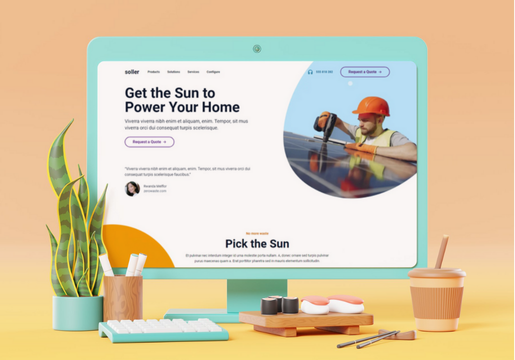

# Soller - Solar Panel (Buzzvel 2024 Dev Team Test)


<br/>
<br/>


## Table of Contents

- [Soller - Solar Panel (Buzzvel 2024 Dev Team Test)](#soller---solar-panel-buzzvel-2024-dev-team-test)
  - [Table of Contents](#table-of-contents)
  - [Overview](#overview)
  - [Demo](#demo)
  - [Features](#features)
  - [Technologies Used](#technologies-used)
  - [Installation](#installation)
    - [Prerequisites](#prerequisites)
    - [Step-by-Step Guide](#step-by-step-guide)
  - [Contact](#contact)

## Overview

Soller is a **Single Page Application (SPA)** developed to replicate and enhance the design in Figma for a fictional solar panel installation company. This project was created as part of the selection process for Buzzvel, showcasing advanced web development skills with a focus on **performance**, **SEO**, **accessibility**, **best practices**, and **responsiveness**.  
**✨ Built by me in just one day! ✨**

 <!-- Replace with an actual screenshot link -->

## Demo

Access the live demo hosted on Vercel [here](https://buzzvel-test-swart.vercel.app/).

## Features

- **📱 Responsive Design:** Fully adaptable to all screen resolutions, ensuring a consistent experience on both mobile devices and desktops.
- **🔍 SEO Optimized:** Implementation of meta tags, semantic HTML, and other techniques to enhance visibility on search engines.
- **⚡ Superior Performance:** Fast loading times with 100 scores on Google PageSpeed and 100% performance on GTmetrix.
- **♿ Accessibility:** Compliance with accessibility standards to ensure all users can navigate the site with ease.
- **🎨 Smooth Animations:** Utilization of Framer Motion for transitions and animations that enhance user experience without compromising performance.
- **🧹 Clean Code Practices:** Organized and maintainable code structure following modern web development standards.
- **🔄 Componentization:** Efficient reuse of React components to facilitate maintenance and scalability.

## Technologies Used

-  **[React](https://reactjs.org/):** JavaScript library for building user interfaces.
-  **[Next.js](https://nextjs.org/):** React framework for server-side rendering and static site generation.
-  **[Tailwind CSS](https://tailwindcss.com/):** Utility-first CSS framework for rapid and responsive styling.
-  **[Framer Motion](https://www.framer.com/motion/):** Library for creating fluid and interactive animations.
-  **[TypeScript](https://www.typescriptlang.org/):** Superset of JavaScript that adds static typing.
-  **[React Helmet](https://github.com/nfl/react-helmet):** Managing meta tags for SEO.
-  **[React Slick](https://react-slick.neostack.com/):** Responsive carousel for testimonials.

## Installation

### Prerequisites

Before you begin, ensure you have the following installed on your machine:

- **💻 Git:** Version control system to clone the repository.
- **🟢 Node.js** (v14 or higher): JavaScript runtime environment.
- **📦 npm** or **🧶 Yarn:** Package managers to install dependencies.

### Step-by-Step Guide

Follow these detailed steps to set up and run the Soller project locally:

1. **🔍 Verify Git Installation**

   - **Open Terminal:** Access your terminal application (Command Prompt, Git Bash, Terminal, etc.).
   - **Check Git Version:**
     ```bash
     git --version
     ```
     - **If Installed:** You will see the Git version number (e.g., `git version 2.30.0`).
     - **If Not Installed:** Download and install Git from the [official website](https://git-scm.com/downloads). Follow the installation instructions for your operating system.

2. **⚙️ Verify Node.js and npm Installation**

   - **Check Node.js Version:**
     ```bash
     node -v
     ```
     - **If Installed:** You will see the Node.js version number (e.g., `v16.13.0`).
     - **If Not Installed:** Download and install Node.js from the [official website](https://nodejs.org/). This will also install npm.

   - **Check npm Version:**
     ```bash
     npm -v
     ```
     - **If Installed:** You will see the npm version number (e.g., `7.24.0`).
     - **If Not Installed:** npm is installed automatically with Node.js. If you encounter issues, refer to the [npm installation guide](https://docs.npmjs.com/downloading-and-installing-node-js-and-npm).

3. **📥 Clone the Repository**

   - **Navigate to Desired Directory:**
     ```bash
     cd path/to/your/directory
     ```
     Replace `path/to/your/directory` with the path where you want to clone the project.

   - **Clone the Repository:**
     ```bash
     git clone https://github.com/devnerii/Buzzvel-FE-Test-2024
     ```
     This command creates a local copy of the repository in your specified directory.

4. **📂 Navigate to the Project Directory**

   - **Change Directory:**
     ```bash
     cd Buzzvel-FE-Test-2024
     ```
     You are now inside the project folder.

5. **📦 Install Project Dependencies**

   - **Using npm:**
     ```bash
     npm install
     ```
   - **Or Using Yarn:**
     ```bash
     yarn install
     ```
     This command installs all the necessary libraries and packages required for the project.

6. **🔨 Build the Project**

   - **Compile the Project:**
     ```bash
     npm run build
     ```
     Or, if using Yarn:
     ```bash
     yarn build
     ```
     This command compiles the project, preparing it for production.

7. **🚀 Start the Development Server**

   - **Run the Development Server:**
     ```bash
     npm run dev
     ```
     Or, alternatively:
     ```bash
     npm run start
     ```
     This command starts the local development server.

8. **🌐 Access the Project in Your Browser**

   - **Open Your Browser:**
     Navigate to [http://localhost:3000](http://localhost:3000) in your preferred web browser.
   - **View the Application:**
     You should now see the Soller application running locally on your machine.

9. **🛠 Troubleshooting**

   - **Common Issues:**
     - **Missing Dependencies:** Ensure all dependencies are installed correctly. Rerun `npm install` if necessary.
     - **Port Conflicts:** If port `3000` is in use, you can specify a different port by modifying the start script or setting an environment variable.
     - **Build Errors:** Check the terminal for error messages and ensure your Node.js version meets the prerequisites.

10. **🎉 You're All Set!**

    - **Explore the Project:**
      Feel free to explore the codebase, make changes, and see them reflected in real-time if you're running the development server.
    - **Contribute:**
      If you find any issues or have suggestions, feel free to open an issue or submit a pull request on the [GitHub repository](https://github.com/devnerii/Buzzvel-FE-Test-2024).

---

## Contact

- **🔗 [LinkedIn](https://www.linkedin.com/in/daniel-neri-51a7b12b3/):** Connect with me professionally.
- **🌐 [Personal Website](https://www.danielneri.online/):** Explore more of my work and projects.
- **✉️ Email:** [dnnxzz70@gmail.com](mailto:dnnxzz70@gmail.com)

If you encounter any issues or have questions, please refer to the project's [documentation](#) or reach out to me directly. Happy coding! 🚀
